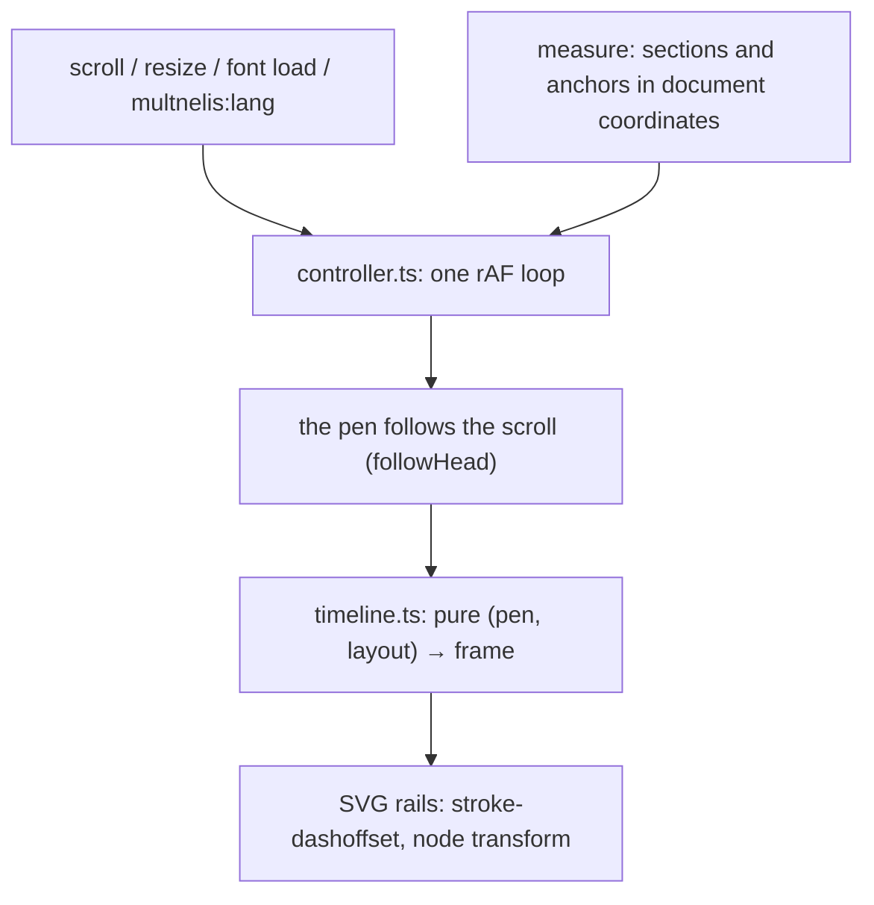

# Architecture

Status: implemented.

## Data flow

One input, one owner of the rail's state, one renderer. Nothing else writes the rail's strokes or nodes.



- **Measure** runs at load, on `document.fonts.ready`, on resize (window and a `ResizeObserver` on every section) and on `multnelis:lang`. It reads section and anchor positions, asks `geometry.ts` for each section's shape, writes the SVG, and keeps every path's polyline in document coordinates. It is the only code that reads layout, and takes about 1ms.
- **Controller** subscribes to `scroll` (passive) and runs animation frames only while the pen is moving. Each frame reads `scrollY` and the viewport height, moves the pen, asks the timeline for the frame and writes only the values that changed.
- **Timeline** is pure and owns every constant. Given a pen position it returns the same frame; the pen itself always settles on the position the scroll implies, so reverse scroll, scrollbar jumps and reloading mid-page all end on the same picture.

This replaced the rail's one-shot `IntersectionObserver` with its `.drawn` class and the CSS transitions on `stroke-dashoffset` and node transforms.

## Modules

```text
src/layouts/Layout.astro                 inline head script: html.is-static under reduced motion or ?static, before first paint
src/components/site/Rail.astro           placeholder <svg> per section; starts the controller; the hover pulse
src/components/site/rail/geometry.ts     pure: a section's lanes as SVG path data and as polylines, and its commits
src/components/site/rail/timeline.ts     pure: constants, where the pen belongs, how it follows, drawn lengths, node landing
src/components/site/rail/controller.ts   measure, the one rAF loop, every DOM write
```

`timeline.ts` is the public seam of the unit tests; nothing in it touches the DOM. The polylines come from the same primitives that write the SVG path data, so what is measured and what is drawn are one shape. (A first version sampled the rendered paths with `getPointAtLength`: 35ms per measure, three times at load.)

## Domain model

```ts
interface PathTrack {
  lane: Lane;
  xs: Float32Array; // document coordinates
  ys: Float32Array; // never decreasing
  lengths: Float32Array; // distance along the path at each point
  total: number;
}

interface Layout {
  docHeight: number;
  paths: PathTrack[];
  nodes: RailNode[]; // document coordinates
}

interface Frame {
  drawn: Float32Array; // px of each path drawn
  nodes: Float32Array; // landing progress, 0..1
}
```

Every progress value passes through `normalize()`, which clamps to 0..1.

## Dependencies

| Dependency                | Kind        | Why                                                                                                       |
| ------------------------- | ----------- | --------------------------------------------------------------------------------------------------------- |
| `vitest` ^5               | dev         | Unit tests for the timeline. Supports the project's Vite 8.                                               |
| `@playwright/test` 1.63.0 | dev, pinned | End-to-end and visual tests. Pinned to the CI image's version, because the visual baselines depend on it. |

No runtime dependency. The rail script is 2.9 KB gzipped. Not used: GSAP, Motion, anime.js, Lenis (the timeline is a few lines of arithmetic and the scroll stays native), CSS scroll-driven animations (they cannot express "drawn down to the pen" for curved paths measured in script), and three.js (the first round's 3D overture was rejected; see `discovery.md`).

## Responsive tiers

| Tier                        | Rail                                   |
| --------------------------- | -------------------------------------- |
| Desktop (> 720px)           | 120px rail, 6px strokes, scroll-drawn  |
| Phone (≤ 720px)             | 48px rail, 4px strokes, scroll-drawn   |
| Reduced motion or `?static` | Fully drawn from the start             |
| No JavaScript               | No rail (as before); all content shown |

## Accessibility

Every rail is `aria-hidden`. Text, headings and reading order are untouched by the motion. There is no scroll locking; browser zoom changes the viewport and re-measures.

## Performance

Measured on the production build in headless Chromium 1.63 on an Apple M5 Pro (Metal GPU), with 4× CPU throttling while scrolling the whole page by mouse wheel.

| Measure                           | Desktop 1440×900 | Phone 390×844 |
| --------------------------------- | ---------------- | ------------- |
| LCP (unthrottled)                 | 52 ms            | 36 ms         |
| CLS, load and full scroll         | 0                | 0             |
| Long tasks at load                | none             | none          |
| Long tasks while scrolling        | none             | none          |
| Script time over the whole scroll | 19 ms            | 23–30 ms      |

- Measuring takes about 1ms; the rail script is 2.9 KB gzipped.
- One phone run showed two long tasks (about 60ms) while scrolling; repeated runs showed none, and a run with the motion switched off (`?static`) showed the same kind of tasks, so they come from the headless harness, not the page.
