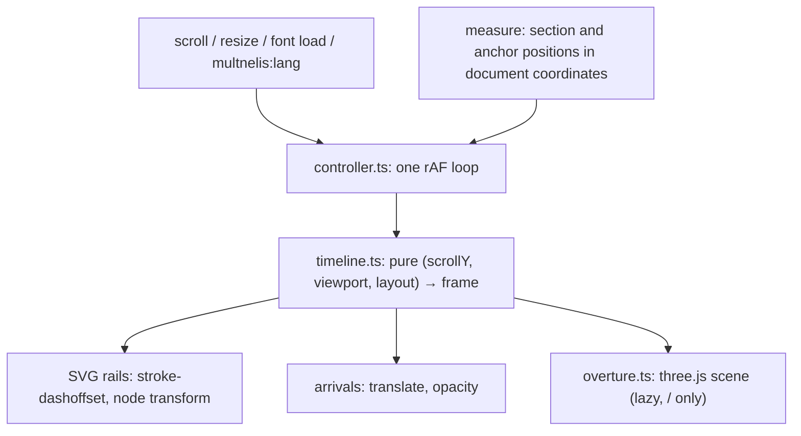

# Architecture

Status: implemented.

## Data flow

One input, one owner of visual state, three renderers. Nothing else writes rail styles, node styles or arrival transforms.



- **Measure** runs at load, on `document.fonts.ready`, on resize (window and a `ResizeObserver` on every section) and on `multnelis:lang`. It reads section and anchor positions through the `offsetTop` chain, which ignores transforms, so an arriving heading's 16px rise never moves its commit. It asks `geometry.ts` for each section's shape, writes the SVG, and keeps every path's polyline in document coordinates. It is the only code that reads layout, and it costs about 1ms.
- **Controller** subscribes to `scroll` (passive) and schedules at most one frame. Each frame reads `scrollY` and the viewport size, calls the timeline, and writes only the values that changed. No layout is read per frame.
- **Timeline** is pure and owns every range and constant (`scroll-timeline.md`). Same inputs, same frame, which is what makes reverse scroll, scrollbar jumps and reloading mid-page correct by construction.
- **Renderers** only apply the frame. The overture module is dynamically imported the first time its progress is below 1, and hides itself (no rendering) whenever its progress reaches 1.

This replaced the rail's one-shot `IntersectionObserver` with its `.drawn` class and the CSS transitions on `stroke-dashoffset` and node transforms: two systems writing the same properties is exactly what a single owner rules out.

## Modules

Following the existing convention (site components under `src/components/site/`, no feature folders):

```text
src/layouts/Layout.astro                 inline head script: is-static | is-live (+ has-overture), before first paint
src/components/site/Rail.astro           placeholder <svg> per section; starts the controller; the hover pulse
src/components/site/Overture.astro       the hero band: a fixed stage with a <canvas> and three labels; aria-hidden
src/components/site/rail/geometry.ts     pure: a section's lanes as SVG path data and as polylines, and its commits
src/components/site/rail/timeline.ts     pure: config, draw head, drawn lengths, node and arrival progress, overture state
src/components/site/rail/controller.ts   measure, the one rAF loop, every DOM write
src/components/site/rail/overture.ts     three.js: camera fit, graph pose, projection, rendering
```

`timeline.ts` and the projection exported by `overture.ts` are the public seams of the unit tests; nothing in them touches the DOM.

The polylines come from the same primitives that write the SVG path data (straight runs cut every 8px, each S-curve into 24 pieces), so the rail, the timeline and the overture share one shape. An earlier version sampled the rendered paths with `getPointAtLength`; that took 35ms per measure, three times at load, and showed up as a long task.

## Domain model

```ts
type Lane = 'm' | 'u' | 'y' | 't';

interface PathTrack {
  lane: Lane;
  xs: Float32Array; // document coordinates
  ys: Float32Array; // never decreasing
  lengths: Float32Array; // distance along the path at each point
  total: number;
}

interface Layout {
  docHeight: number;
  paths: PathTrack[];
  nodes: RailNode[]; // document coordinates
  arrivals: { y: number; order: number }[];
  overture: { band: { top: number; height: number }; pivot: { x: number; y: number }; laneSpan: number } | null;
}

interface Frame {
  head: number; // the draw head, document y
  drawn: Float32Array; // px of each path drawn
  nodes: Float32Array; // landing progress, 0..1
  arrivals: Float32Array; // arrival progress, 0..1
  overture: OvertureState | null;
}
```

Every progress value passes through `normalize()`, which clamps to 0..1, so everything downstream receives a valid share.

## The overture's 3D

The scene is the page's own graph: the measured polylines, in document coordinates, on a plane. The camera always sits where it sees that plane at 1:1, centred on the viewport (`fitCamera`: field of view 30°, distance `(vh / 2) / tan(15°)`). The overture state moves the plane, not the camera: it places the first commit at `pivot`, tilts the plane by `tilt` about it, scales it by `scale`, and stretches the lanes apart by `spread`. At the end of the dive those are the first commit's real position, 0, 1 and 1, so the projection is the identity on the rail's pixels; that invariant makes the handoff seamless, and a unit test holds it.

At the start, `scale` is solved so the tilted graph's last commit lands at the band's lower inset (the derivation is in `timeline.ts`), and `spread` makes the lanes span 22% of the viewport's width (50% on phones). During the dive `scale` grows geometrically to 1, the lanes' span on the plane closes linearly to the rail's, and the pivot slides to the rail column.

Rendering: each lane is a `Line2` with a `LineMaterial` in world units (so strokes thin with distance, have round ends, and are exactly 6px at 1:1) over a 1.5px hairline copy; colour retracts to the timeline's `limit` by drawing only the segments above it (`instanceCount`); commits are flat discs with the rail's white ring. Labels are HTML spans placed with the same projection. Depth testing is off and draw order mirrors the SVG's stacking. The stage is `position: fixed`, `pointer-events: none`, and the renderer's pixel ratio is capped at 2.

## Dependencies

| Dependency                | Kind          | Why                                                                                                                                                                              |
| ------------------------- | ------------- | -------------------------------------------------------------------------------------------------------------------------------------------------------------------------------- |
| `three` ^0.186            | runtime, lazy | The overture (user decision). 138 KB gzipped, in its own chunk, fetched only when the overture runs: never on `/contact`, under reduced motion, with Save-Data or without WebGL. |
| `@types/three` ^0.186     | dev           | Types for `astro check`.                                                                                                                                                         |
| `vitest` ^5               | dev           | Unit tests for the timeline and the overture's landing. Supports the project's Vite 8.                                                                                           |
| `@playwright/test` 1.63.0 | dev, pinned   | End-to-end and visual tests. Pinned to the CI image's version, because the visual baselines depend on that image.                                                                |

The always-loaded rail script is 4.5 KB gzipped.

Not used: GSAP, Motion, anime.js and Lenis (the timeline is a handful of normalized ranges and one ease; the scroll stays native), and CSS scroll-driven animations (they cannot express "drawn down to the head" for curved paths measured in script, and a second timing system would break the single-owner rule).

## Responsive tiers

| Tier                        | Overture                                                       | Rail and arrivals                      |
| --------------------------- | -------------------------------------------------------------- | -------------------------------------- |
| Desktop (> 720px)           | 50svh band; tilt 74°; lanes span 22% of the width; labels      | 120px rail, 16px arrivals              |
| Phone (≤ 720px)             | 40svh band; tilt 66°; lanes span 50%; labels hidden at ≤ 440px | 48px rail, 12px arrivals               |
| Reduced motion or `?static` | None                                                           | Fully drawn, everything in place       |
| No WebGL or Save-Data       | None (no band)                                                 | Full replay                            |
| No JavaScript               | None (no band)                                                 | No rail (as before); all content shown |

## Accessibility

The 3D stage and every rail are `aria-hidden`. Reading order and headings are unchanged. Arrivals change only `translate` and `opacity`, and every arriving element is in the accessibility tree at all times. When keyboard focus lands inside an element that has not arrived (a repository chip reached by Tab), it is shown in place at once. There is no scroll locking; browser zoom changes the viewport and re-measures. If the script never runs after the head script has hidden the arrivals, a CSS fallback shows them after 3 seconds.

## Performance

Measured on 2026-10-07 against the production build. The profiles ran in headless Chromium 1.63 on an Apple M5 Pro: the "GPU" runs used Metal, the "software" runs SwiftShader, both with 4× CPU throttling while scrolling the whole page down and back up by mouse wheel.

| Measure                                   | Desktop GPU | Desktop software GL | Phone GPU |
| ----------------------------------------- | ----------- | ------------------- | --------- |
| LCP (unthrottled)                         | 76 ms       | 484 ms              | 72 ms     |
| CLS, load and full scroll                 | 0           | 0                   | 0         |
| Long tasks while scrolling                | none        | none                | none      |
| Long tasks at load                        | none        | one, 416 ms         | none      |
| Script time while scrolling (≈300 frames) | 48 ms       | 59 ms               | 58 ms     |

- `measure()` takes about 1ms; the overture renders in 0.5ms on average per frame on the GPU (10.6ms for its first frame, which compiles the shaders).
- The frame interval in these headless runs is the same with the page in `?static` mode (no scroll motion at all), so it reflects the harness, not the page.
- Known limitation: on a machine with no usable GPU, compiling the overture's shaders on the software renderer is a single 416ms task right after load. Skipping the overture there would need either a WebGL probe before every first paint or collapsing the band after load (a layout shift); neither was worth it for those rare setups.
- Known limitation: if the page's script fails to load while the head script ran, the overture band stays as empty space; the arriving headings still appear after 3 seconds.
